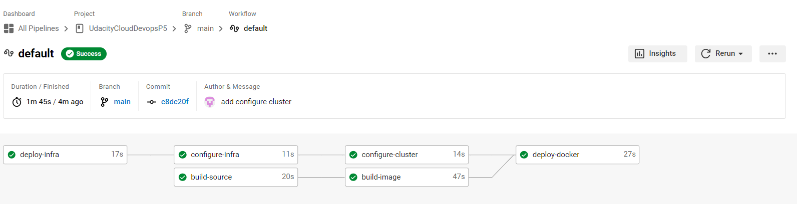

# UdacityCloudDevopsP5
This project represents the successful completion of the last final Capstone project and the Cloud DevOps Engineer Nanodegree at Udacity.

## What did I learn?
Through dedicated learning, I have become proficient in implementing Continuous Integration and Continuous Deployment using CircleCI. I've honed my ability to construct efficient pipelines that automate software delivery stages. Working with Ansible and CloudFormation, I can deploy clusters swiftly, ensuring consistent environments. Building and managing Kubernetes clusters is another skill I've mastered, enhancing application scalability. I'm also skilled in crafting Docker containers within pipelines, streamlining deployment. 

## Application
This application reuses the problem in project 4. Operationalize a Machine Learning Microservice API

## Kubernetes Cluster
I employed AWS CloudFormation to orchestrate the deployment of the Kubernetes Cluster. The process of CloudFormation Deployment including four key components:

Networking: Establishing seamless communication channels between new nodes and the Cluster.
Utilizing Elastic Kubernetes Service (EKS): for the generation of the Kubernetes Cluster.
NodeGroup Setup: Defining rules that govern instance operations and creation within the EKS-Cluster.
Management: Configuring and overseeing the Cluster, including its deployments and services.

#### List of cloudformation Stacks:

#### List of EC2:

## CircleCi - CI/CD Pipelines

I used CircleCi to create a CI/CD Pipeline to build, test and deploy system.

## Linting Error

## Linting Success

## Access the Application
After the EKS-Cluster has been successfully configured using Ansible within the CI/CD Pipeline, I get LB info as below:

Public LB DNS: abd2adf4ef6304291b77b0f4881bf2b9-2043865142.us-east-1.elb.amazonaws.com
